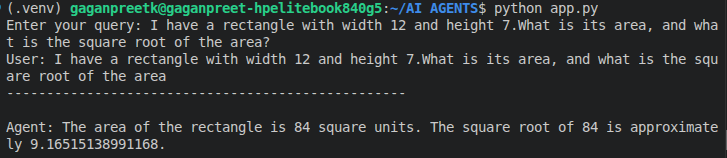

# 🤖 AI Agent using LangChain

This project is part of my **Oracle Agentic AI Foundations** course.

## 📌 Project Overview

This is a simple AI Agent built using **LangChain**. The agent can understand natural language questions and decide when to use mathematical tools to solve them.

## 🚀 Features

- Addition
- Subtraction
- Multiplication
- Division
- Square Root
- Tool Calling using LangChain
- Interactive Command Line Interface (CLI)

## 🛠️ Technologies Used

- Python
- LangChain
- Groq API / Google Gemini API
- python-dotenv

## 📂 Project Structure

```
AI-Agent/
├── app.py
├── requirements.txt
├── README.md
├── .gitignore
└── screenshots/
```

## ▶️ Installation

Clone the repository:

```bash
git clone <repository-url>
```

Install dependencies:

```bash
pip install -r requirements.txt
```

Create a `.env` file:

```env
GROQ_API_KEY=your_api_key_here
```

Run the project:

```bash
python app.py
```

## 📸 Sample Outputs

### Rectangle Area & Square Root




## 📖 Learning Outcomes

Through this project I learned:

- Creating AI Agents using LangChain
- Tool Calling
- Prompt handling
- API integration
- Building command-line AI applications

## 👩‍💻 Author

**Gaganpreet Kaur**